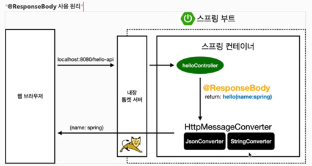

### http요청 - 기본, 헤더 조회

## 응답 - 정적 리소스, 뷰 템플릿
- 스프링에서 응답 데이터를 만드는 방법은 3가지 이다.

1) 정적 리소스
   - html,css,js 제공 -> 정적
2) 뷰 템플릿 사용
   - 서버사이드렌더링 -> 동적
3) http메시지 사용
   - RestAPI 사용, http메시지 바디에 json 형식으로 보내는 것

### 정적 리소스
- /static
- /public
- /resources
- /META-INF/resources

보통 src/main/resources/static 이다   

### 뷰 템플릿
src/main/resources/templates 경로를 기본적으로 이용한다

@ResponseBody가 없으면, response/hello로 뷰 리졸버가 실행되어서 뷰를 찾고, 렌더링 한다.

### http메시지 사용
html이나 뷰 템플릿을 사용해도 http 응답 메시지 바디에 html데이터가 담겨서 전달된다. 
여기서 설명하는 내용은 정적 리소스나 뷰 템플릿을 거치지 않고, 직접 http 응답 메시지를 전달하는 경우를 말한다.

### http 메시지 컨버터

뷰리졸버 대신에 httpMessageConverter가 작동이 된다 

