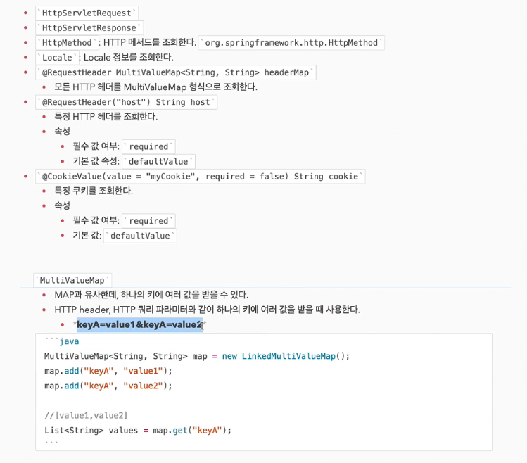

### http요청 - 기본, 헤더 조회

## 응답 - 정적 리소스, 뷰 템플릿
- 스프링에서 응답 데이터를 만드는 방법은 3가지 이다.

1) 정적 리소스
   - html,css,js 제공 -> 정적
2) 뷰 템플릿 사용
   - 서버사이드렌더링 -> 동적
3) http메시지 사용
   - RestAPI 사용, http메시지 바디에 json 형식으로 보내는 것

### 정적 리소스
- /static
- /public
- /resources
- /META-INF/resources

보통 src/main/resources/static 이다   

### 뷰 템플릿

### http메시지 사용