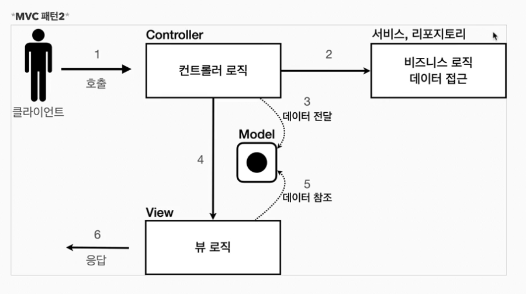

## MVC

<b>"너무 많은 역할"</b><br>
하나의 서블릿이나 JSP만으로 비즈니스 로직과 뷰 렌더링까지 처리하게 되면<br>
너무 많은 역할을 하게된다.

<b>"변경의 라이프 사이클"</b><br>
UI를 일부 수정하는 일과 비즈니스 로직을 수정을 하는일은 각각 다르게 발생할 가능성이 높고<br>
대부분 서로에게 영향을 주지 않는다. 이렇게 변경의 라이프 사이클이 다른 부분을 <br>
하나의 코드로 관리하는 것은 유지보수 하기 좋지 않다


<b>"기능 특화"</b><br>
특히 JSP같은 뷰 템플릿은 화면을 렌더링 하는데 최적화 되어 있기 때문에<br>
이 부분의 업무만 담당하는 것이 효과적이다

### Model View Controller
MVC 패턴은 지금까지 학습한 것 처럼 하나의 서블릿이나, JSP로 처리하던 것을<br> 
컨트롤러 , 뷰 라는 영역으로 서로 역할을 나눈 것을 말한다. 보통 웹 에서는 MVC패턴 많이 사용함<br>

### 컨트롤러
HTTP 요청을 받아서 파라미터를 검증하고, 비즈니스 로직을 실행한다.<br>
그리고 뷰에 전달할 결과 데이터를 조회해서 모델에 담는다.

### 뷰
화면에 보이는 UI를 담당하는 부분이다. <br>
모델에 담긴 데이터를 렌더링하여 HTML을 생성함


### 모델
View에 출력할 데이터를 담아둔다. View가 필요한 데이터를 모델에 담아서 전달해주는 덕분에<br>
뷰는 비즈니스 로직이나 데이터 접근이 필요없고, 화면을 렌더링하는데에 집중할 수 있다.


Ex) 예시 사진1

Ex) 예시 사진1


### 📢 참고
컨트롤러에 비즈니스 로직을 둘 수 있지만, 이렇게 되면 컨트롤러가 많은 역할을 담당한다 <br>
❗ 컨트롤러는 비즈니스 로직을 호출하는데 중점을 맞춘다.<br>
그래서 일반적으로 비즈니스 로직은 -> 서비스(Service)라는 계층을 별도로 만들어서 처리한다.<br>
그리고 컨트롤러는 비즈니스 로직이 있는 서비스를 호출하는 역할을 담당한다<br>
비즈니스 로직을 변경시 비즈니스 로직을 호출하는 컨트롤러의 코드도 변경될 수 있다.<br>

## 실제 적용
1) Model
2) servlet -> Controller
3) Jsp -> view

```java
@WebServlet(name="mvcMemberFromServlet", urlPatterns = "/servlet-mvc/members/new-form")
public class MvcMemberFromServlet extends HttpServlet {
	@Override
	protected void service(HttpServletRequest req, HttpServletResponse resp) throws ServletException, IOException {
		String viewPath = "/WEB-INF/views/new-form.jsp";
		RequestDispatcher dispatcher = req.getRequestDispatcher(viewPath);
		dispatcher.forward(req,resp);
	}
}
```
> dispatcher.forward(req,resp) -> 다른 서블릿이나 JSP로 이동할 수 있는 기능 (서버 내부에서 다시 호출됨)<br>

- redirect vs forward
redirect는 실제 클라이언트(웹 브라우저)에 응답이 나갔다가, 클라이언트가 redirect경로로 다시 요청한다<br>
따라서 클라이언트가 인지할 수 있고, URL 경로도 실제로 변경된다.
반면에 포워드는 서버 내부에서 일어나느 호출이기 때문에 클라이언트가 인지하지 못한다. 

------

- 🖐 정리 🖐
- 서비스 -> 레포지토리 -> 결과를 모델에 담아서 -> 뷰에서 사용<br>
- MVC 패턴은 컨트롤러를 거치고 View로 간다<br>
- WEB-INF는 직접 View를 못 들어간다


> 결과 
>> MVC패턴 덕분에 컨트롤러로직과 뷰 로직을 확실하게 분리한 것을 확인할 수 있다
>>> 향후 화면에 수정이 발생하면 뷰 로직만 변경하면 된다.
> 
---

## MVC패턴 한계
MVC 패턴을 적용한 덕분에 컨트롤러의 역할과 뷰를 렌더링 하는 역할을 명확하게 구분 가능<br>
특히 뷰는 화면을 그리는 역할에 충실한 덕분에, 코드가 깔끔하고 직관적이다<br>
단순하게 모델에서 필요한 데이터를 꺼내고, 화면을 만든다<br>
하지만 ❗ 컨트롤러는 중복이 많고, 필요하지 않은 코드들이 많이 보인다

### MVC 컨트롤러의 단점
#### 1) 포워드 중복
View로 이동하는 코드가 항상 중복 호출되어야 한다. 물론 이부분을 메소드로 공통화해도 되지만, 해당 메서드도
항상 직접 호출 해야한다
```java
RequestDispatcher dispatcher = request.getRequestDispatcher(viewPath);
dispatcher.forward(request,response);
```
#### 2) ViewPath의 중복
```java
String viewPath = "/WEB-INF/views/new-form.jsp";
```
- prefix : '/WEB-INF/vidws/new-form.jsp'
- suffix : .jsp
그리고 만약 jsp가아닌 html파일을 사용한다면 위 설정을 바꿔줘야 한다.

#### 3) 사용하지 않는 코드
httpservlet -> request, response 특히  response는 사용되지 않아도 계속 있다.

#### 4) 공통처리가 어렵다
기능이 복잡해질 수록 컨트롤러에서 공통으로 처리해야하는 부분이 점점 많이 증가할 것이다.<br>
단순히 공통기능을 메소드로 뽑으면 될 것같지만, 결과적으로 해당 메서드를 항상 호출해야한다<br>
호출하지 않는다면 에러가 생길 것이다. 호출하는 것 자체가 <b style="color:red">중복</b>이다

#### 5) 정리하면 공통 처리가 어렵다는 문제가 있다
이 문제를 해결하려면 컨트롤러 호출 전에 먼저 공통 기능을 처리해야 한다.<br>
소위 '수문장 역할'을 하는 기능이 필요하다.<br>
'프론트 컨트롤러 패턴'을 도입하면 이런 문제를 깔끔하게 해결할 수 있다. (입구를 하나로)<br>
스프링 MVC의 핵심도 바로 이 <b>프론트 컨트롤러</b> 입니다


#### 6) 궁금한점 찾기

