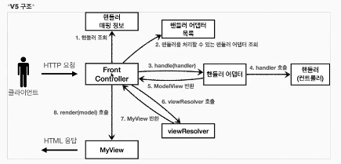

## 유연한 컨트롤러
한개의 프로젝트 안에서 다양한 컨트롤러를 사용하고 싶다면? 

### "어댑터 패턴"
을 사용해야 한다. 
우리가 사용했던 컨트롤러는 한 가지 방식의 컨트롤러 인터페이스만 사용할 수 있다 

어댑터 패턴을 사용한다면, 프론트 컨트롤러가 다양한 방식의 컨트롤러를 처리할 수 있도록 변경해보자 

- "핸들러 어댑터" : 중간에 어댑터 역할을 하는 어댑터가 추가 되었는데 이름이 핸들러 어댑터 이다.
  여기서 어댑터 역할을 해주는 덕분에 다양한 종류의 컨트롤러를 사용할 수 있다.
- "핸들러" : 컨트롤러의 이름을 더 넓은 범위의 핸들러로 변경했다. 그 이유는 이제 어댑터가 있기 때문에  
꼭 컨트롤러의 개념 뿐만 아니라 어떠한 것이든 해당하는 종류의 어댑터만 있으면 다 처리할 수 있기 때문이다.
 
핸들러는 <b>컨트롤러</b>라고 이해하면 된다 

핸들러 어댑터만 있으면 어떠한 핸들러(=컨트롤러) 랑도 연결할 수 있다.

`단축키` 
클래스. iter -> forEach문 자동 생성
----

### 유연한 컨트롤러2 v5
`controllerV4` 기능도 추가를 해보자
 
`생성 단축키` 
Ctrl + alt + v -> new List 생성시 전체 리스트 생성해줌 

"어댑터 패턴"

