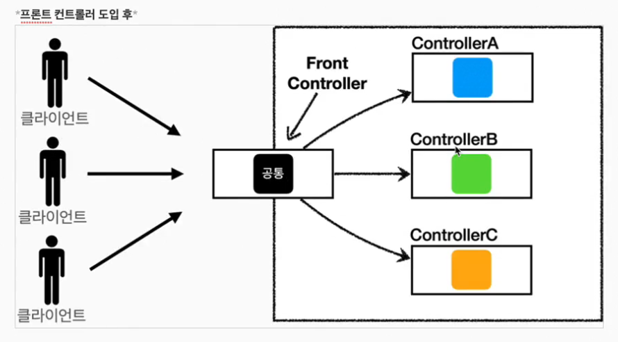
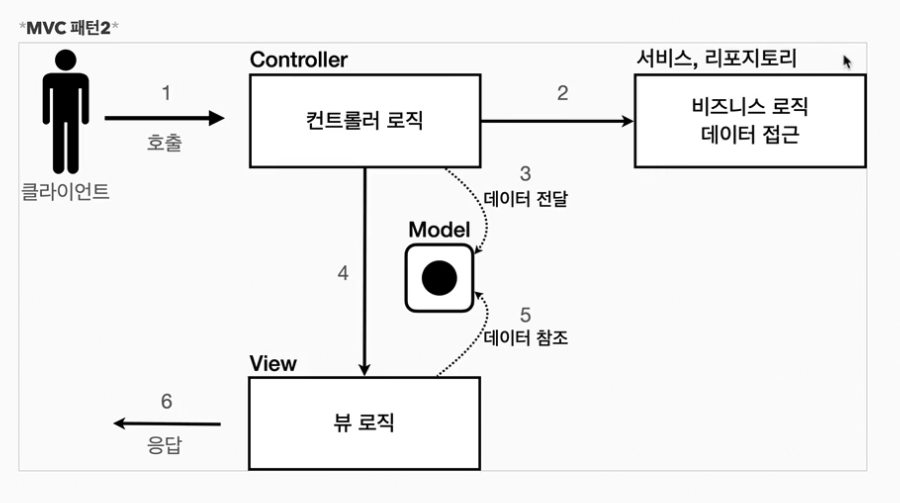
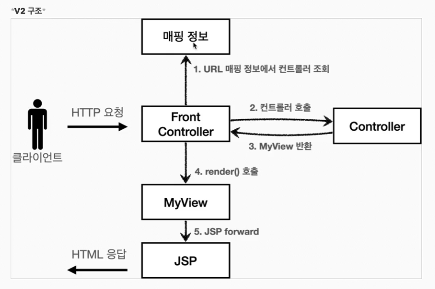
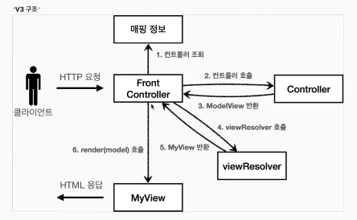
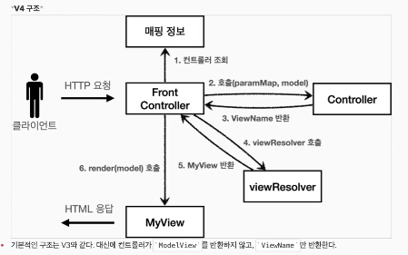

# MVC 프레임워큼 만들기

### 프론트 컨트롤러 패턴 소개

- 공통의 로직을 모으고, 각자의 로직이 필요한 컨트롤러는 각자 코딩
- 프론트 컨트롤러는 서블릿 하나로 클라이언트의 요청을 바등ㅁ
- 입구를 하나로 함
- 공통 처리 가능
- 프론트 컨트롤러를 제외한 나머지 컨트롤러는 서블릿 사용X

> 스프링 웹 MVC의 프론트 컨트롤러
> > 스프링 웹 MVC의 핵심도 바로 "FrontController"
> >> 스프링 웹 MVC의 DispatcherServlet이 Frontcontrolller 패턴으로 구성됨

------
### 프론트 컨트롤러 도입


먼저 구조를 맞추어두고 점진적으로 리팩토링<br>


1) 클라이언트가 http 요청시 프론트 컨트롤러가 받음
2) 매핑정보에서 나한테 매핑된 컨트롤러를 찾는다.
3) 찾아서 컨트롤러를 호출하고 그 컨트롤러가 뷰로 호출한다.
4) JSP가 랜더링 되면서 클라이언트가 html응답을 받는다.

> 컨트롤러 인터페이스를 통해 프론트 컨트롤러는 이 인터페이스를 호출함으로써 구현과 관계없이 로직의 일관성을 가져갈 수 있다


ControlleMap은 
- key : 매핑URL
- value : 호출할 컨트롤러

-----

### View 분리 -v2
모든 컨트롤러에서 뷰로 이동하는 부분에 중복이 있고 깔끔하지않다<br>
별도로 분리하는 뷰를 처리하는 객체를 만들어보자

1) URL 매핑 정보에서 컨트롤러 조회
2) 컨트롤러 호출
3) MyView 반환
4) render()호출
5) JSP forward

----
### Model 추가 -v3
서블릿 종속성 제거<br>
요청 파라미터 정보는 자바의 Map으로 대신 넘기도록 하면 지금 구조에서는 
컨트롤러가 서블릿 기술을 몰라도 동작할 수 있다. <br>
그리고 request 객체를 Model로 사용하는 대신에 별도의 Model 객체를 만들어서 반환하면 된다<br>
- 위 과정을 하면은 테스트 코드 작성이 쉽다.

##### 뷰 이름 중복 제거
즉 프론트 컨트롤러에서 지저분한 일을 다하게 만든다.


View를 찾아 주는 것 -> ViewResolver<br>
ModelView는 View의 이름과 뷰를 렌더링 할 때 필요한
model 객체를 가지고 있다. model은 단순히 map으로 되어 있으므로 컨트롤러에서 뷰에 필요한 데이터를 key,value로 넣어준다.

##### ControllerV3
servlet에 종속적이지 않고 순수하게 자바코드만
우리가 만든ModelView만 넘겨준다.

##### FrontControllerV3


----
#### 단순하고 실용적인 컨트롤러

v3컨트롤러는 서블릿 종속성을 제거하고 뷰 경로의 중복을 제거하는 등, 잘 설계된 컨트롤러 이다<br>
<br>
좋은 프레임워크는 아키텍쳐도 중요하지만, 그와 더불어 설계 개발하는 개발자가 단순하고 편리하게 사용할 수 있어야 한다.<br>

이번에는 v3를 조금 변경해서 실제 구현하는 개발자들이 매우 편리하게 개발할 수 있는 v4의 버전 개발<br>


`개선점`
v4 구조는 컨트롤러가 ModelView를 반환하지 안혹 viewName만 반환한다.<br>

단축키
/** 엔터 시
```
	/**
	 *
	 * @param paramMap
	 * @param model
	 * @return viewName
	 */
```
구조 생성이 됨<br>

🖐 F2 클릭시 에러 라인으로 넘어가짐<br>

이번 버젼은 인터페이스 ModelView가 없다.<br>
model 객체는 파라미터로 전달되기 때문에 그냥 사용하면 되고
결과로 뷰의 이름만 반환해주면 된다.<br>


