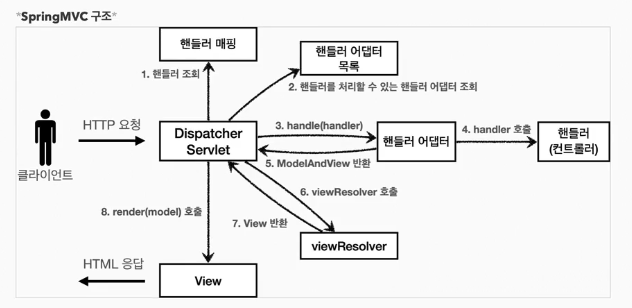

### 직접 만든 MVC 프레임워크 구조

### Spring MVC 구조

#### 직접만 든 프레임워크 -> 스프링MVC 구조
- FrontController -> DispatcherServlet
- handlerMappingMap -> HandlerMapping
- MyHandlerAdapter -> HandlerAdapter
- ModelView -> ModelandView
- viewResolver -> viewRosolver
- MyView -> view

##### DispatcherServlet
스프링 MVC도 프론트 컨트롤러 패턴으로 구현되어 있다 
스프링 MVC의 프론터 컨트롤러가 바로 디스패치 서블릿이다 
-> 이 디스패처 서블릿이 바로 스프링 MVC의 핵심이다 

` 스프링부트는 DispatcherServlet 을 서블릿으로 자동으로 등록하면서 
모든 경로에 대해서 매핑한다`

1) 서블릿이 호출이 되면 HttpServlet이 제공하는 service() 가 호출된다
2) 스프링MVC는 DispathcerServlet의 부모인 FrameworkServlet에서 service()를 오버라이드
3) FrameworkServlet 을 시작으로 여러 메서드가 호출되면서 DispatcherServlet.diDispatch() 호출

### Spring MVC 구조
##### 동작순서
1) 핸들러 조회 : 핸들러 매핑을 통해 요청URL에 매핑된 핸들러를 조회한다
2) 핸들러 어댑터 조회 : 핸들러를 실행할 수 있는 핸들러 어댑터를 조회한다
3) 핸들러 어댑터 실행 : 핸들러 어댑터를 실행한다.
4) 핸들러 실행 : 핸들러 어댑터가 실제 핸들러 실행
5) ModelAndView 반환 : 핸들러 반환 정보를 ModelAndView로 **변환**해서 반환
6) viewResolver 호출 : 뷰 리졸버 찾고 실행한다.
7) View 반환
8) 뷰 렌더링 : 뷰를 통해서 뷰를 렌더링한다.

